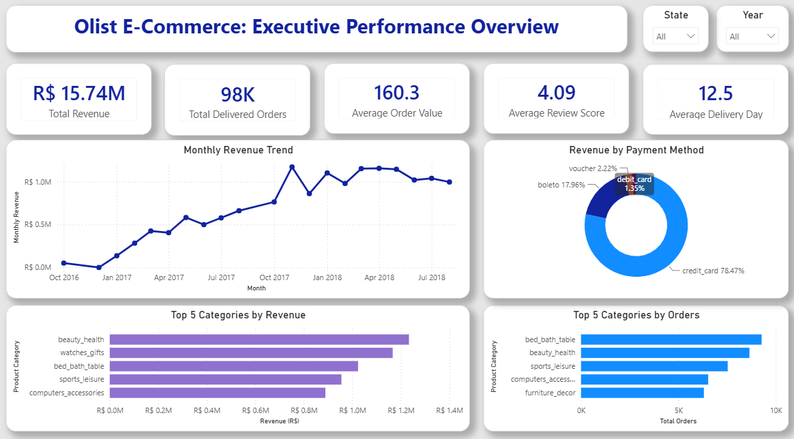
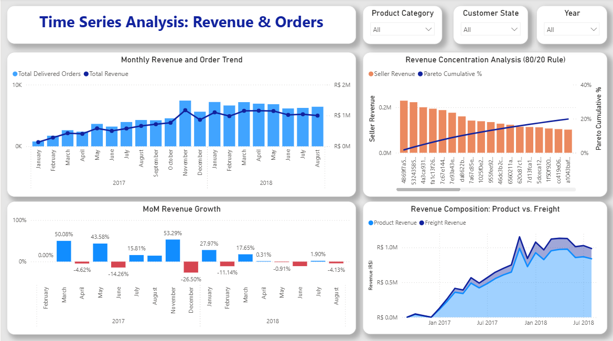
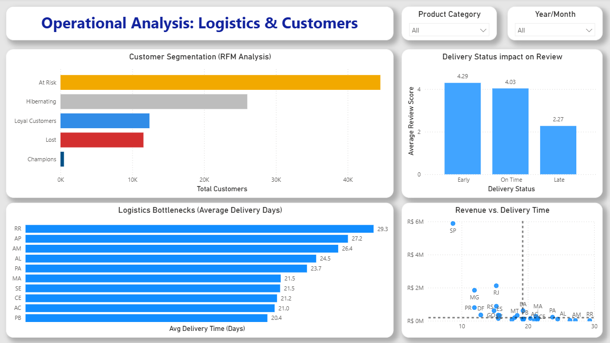
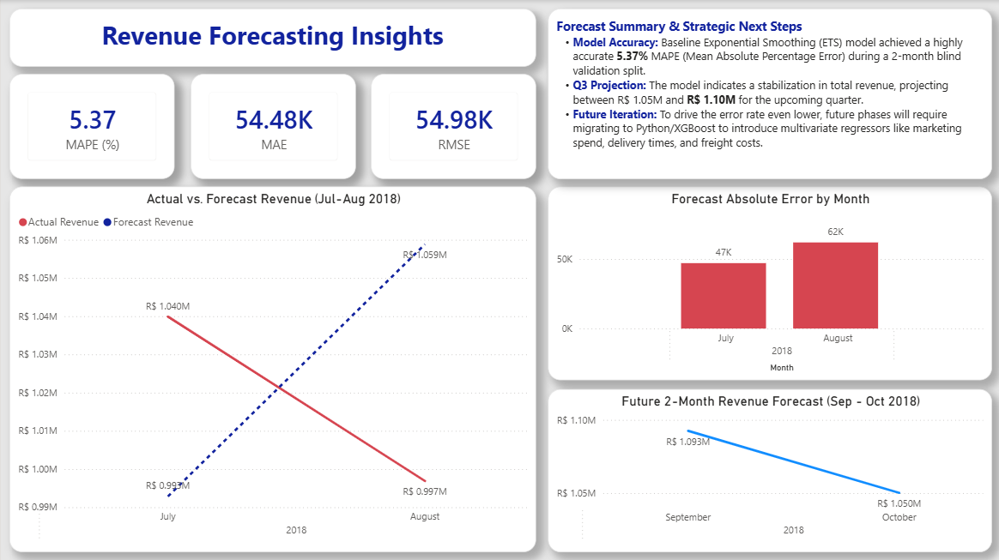

# 🛒 Olist E-Commerce Analytics: From Raw Data to Revenue Forecasting

An end-to-end data analytics project on the Brazilian **Olist E-Commerce dataset**, covering data cleaning, exploratory data analysis, advanced SQL business analytics, and an executive Power BI dashboard with revenue forecasting.


---

## 📌 Project Overview

Olist is a Brazilian e-commerce platform that connects small businesses to major marketplaces. This project simulates a **real-world business analytics engagement**: starting from seven raw, messy CSV tables and ending with an executive-ready BI dashboard and a short-term revenue forecast, backed by a full SQL analytics layer.

**Business question:** *How healthy is the Olist marketplace — in terms of revenue, customer satisfaction, logistics performance, and seller concentration risk — and where is it headed next quarter?*

---

## 🧰 Tech Stack

| Stage | Tools |
|---|---|
| Data Cleaning & EDA | Python, Pandas, NumPy, Matplotlib, Seaborn (Jupyter Notebook) |
| Data Warehousing | MySQL, SQLAlchemy, PyMySQL |
| Advanced Analytics | MySQL (CTEs, Window Functions, Self-Joins) |
| Visualization & Forecasting | Power BI (DAX, ETS forecasting model) |

---

## 🔄 Project Pipeline

### 1. Data Cleaning (`olist_ecommerce.ipynb`)
Seven raw datasets (`customers`, `orders`, `reviews`, `payments`, `order_items`, `products`, `sellers`) were cleaned and prepared for analysis:
- Converted all date/time columns to proper `datetime` objects
- Right-sized data types (`int16`, `int32`, `float32`) to reduce memory footprint
- Audited every table for nulls and duplicates
- Dropped unusable free-text columns (`review_comment_title`, `review_comment_message`) and rows with missing `product_category_name`
- Translated Portuguese product category names into English for readability
- Loaded the cleaned tables into a **MySQL** database (`olist_ecommerce`) via SQLAlchemy for downstream SQL analysis

### 2. Exploratory Data Analysis (EDA)
Univariate and relationship-level analysis directly in the notebook:
- Order status, customer geography, payment method mix, and review score distributions
- Product price distribution
- **Time series decomposition**: monthly, weekday, and quarterly sales trends
- **Logistics vs. satisfaction**: boxplot of delivery time by review score — 5-star orders had a median delivery of ~9 days vs. ~16 days for 1-star orders, with delays beyond ~14 days flagged as the "unacceptable" threshold
- **Revenue vs. volume**: showed that top-selling categories by item count are not always the top revenue drivers, informing a segmented logistics vs. marketing strategy

### 3. Advanced SQL Analysis (`sql_queries_on_olist_dataset.sql`)
16 business-driven SQL problems, progressing from foundational aggregations to executive-level analytics:

**Foundational**
- Total revenue, order status distribution, customer geography, average review score, top categories by volume

**Intermediate**
- Monthly sales trend, revenue by payment type, average delivery speed, top-earning sellers, delivery delay impact on reviews

**Advanced (CTEs & Window Functions)**
- Order status breakdown by state, **Month-over-Month revenue growth** (`LAG()`), repeat customer identification, **cumulative running revenue**, and **RFM (Recency, Frequency, Monetary)** base metrics

**Executive-Level**
- **Pareto (80/20) Analysis**: quantified what percentage of sellers generate 80% of platform revenue using cumulative window functions — a direct answer to marketplace concentration risk

### 4. Power BI Dashboard
A 4-page executive dashboard translating the SQL/EDA findings into decision-ready visuals:

| Page | Focus |
|---|---|
| Executive Performance Overview | Total revenue, delivered orders, AOV, review score, delivery time, monthly trend, payment mix, top categories |
| Time Series Analysis | Revenue & order trend, Pareto (80/20) concentration curve, MoM growth, product vs. freight revenue split |
| Operational Analysis | RFM customer segmentation, delivery status vs. review score, logistics bottlenecks by state, revenue vs. delivery time |
| Revenue Forecasting | ETS (Exponential Smoothing) forecast with 5.37% MAPE, Q3 projection, and strategic next steps |

All pages include interactive slicers (State, Year, Product Category, Year/Month).

### 5. Revenue Forecasting
Built using Power BI's built-in **ETS (Exponential Smoothing)** model:
- Validated on a 2-month blind hold-out split, achieving a **5.37% MAPE**
- Projects total revenue stabilizing between **R$1.05M–R$1.10M** for the upcoming quarter
- Documented as a baseline model, with a planned iteration to Python/XGBoost to incorporate multivariate regressors (marketing spend, delivery time, freight cost)

---

## 📊 Key Business Insights

- 💰 **R$15.74M** in total revenue across **98K** delivered orders, at an average order value of **R$160.3**
- ⭐ Platform-wide average review score of **4.09 / 5**
- 🚚 Average delivery time of **~12.5 days**, with clear regional bottlenecks (RR, AP, AM states averaging 25–30+ days)
- 💳 **Credit card** dominates payment methods at **78.5%** of revenue
- 📉 **Delivery speed is the single strongest driver of satisfaction** — late orders average a 2.27 review score vs. 4.29 for early deliveries
- 📦 Revenue is **concentrated among a minority of sellers**, confirmed via Pareto analysis — a marketplace risk worth monitoring
- 👥 RFM segmentation reveals a large "At Risk" and "Hibernating" customer base, signaling a need for reactivation campaigns over pure acquisition spend
- 🔮 Revenue forecast points to short-term stabilization rather than continued growth, informing Q3 planning

---

## 🖼️ Dashboard Preview

**Executive Performance Overview**


**Time Series & Revenue Concentration Analysis**


**Operational Analysis: Logistics & Customers**


**Revenue Forecasting Insights**


---

## 📁 Repository Structure

```
olist-ecommerce-analytics/
│
├── README.md
├── notebooks/
│   └── olist_ecommerce.ipynb          # Data cleaning + EDA
├── sql/
│   └── sql_queries_on_olist_dataset.sql   # 16 business SQL problems
├── dashboard/
│   └── olist_dashboard.pbix           # Power BI file
└── assets/
    ├── dashboard_1_executive_overview.png
    ├── dashboard_2_time_series.png
    ├── dashboard_3_operational_logistics.png
    └── dashboard_4_revenue_forecasting.png
```

---

## 📂 Dataset

This project uses the **[Brazilian E-Commerce Public Dataset by Olist](https://www.kaggle.com/datasets/olistbr/brazilian-ecommerce)**, containing ~100K orders placed between 2016–2018 across multiple Brazilian marketplaces, including customer, order, payment, review, product, and seller data.

---

## 🚀 How to Reproduce

1. Clone the repo and download the raw Olist CSVs from Kaggle into a `data/` folder
2. Run `notebooks/olist_ecommerce.ipynb` to clean the data and load it into a local MySQL instance
3. Execute `sql/sql_queries_on_olist_dataset.sql` against the `olist_ecommerce` database
4. Open `dashboard/olist_dashboard.pbix` in Power BI Desktop and refresh the data source

---

## 👤 Author

**[Amrit Kumar]**

Built as an end-to-end data analytics portfolio project — from raw data to an executive dashboard and forecast.

- 🔗 LinkedIn: [https://www.linkedin.com/in/amrit-kumar-041a4538a/]
- 💻 GitHub: [https://github.com/Amrit706/]

Feel free to connect or reach out with feedback!
